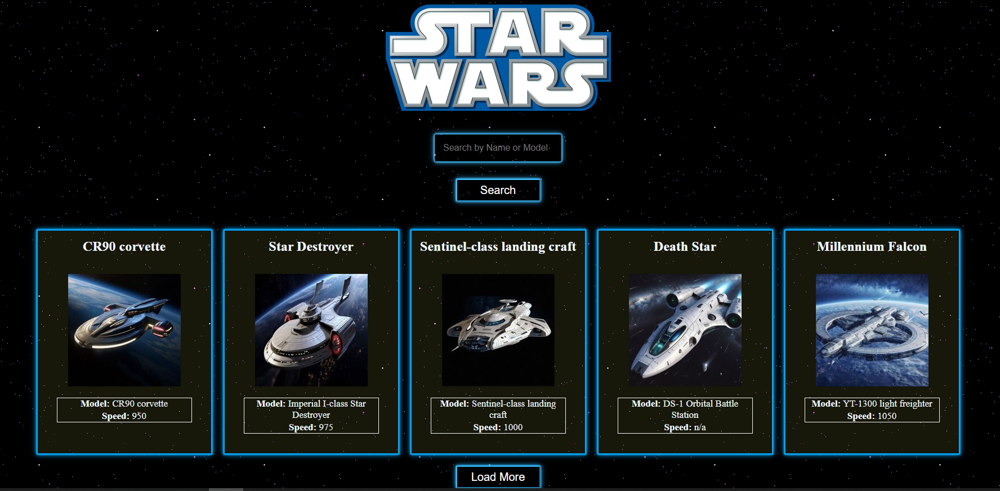

# StarWars - Starships of the StarWars Universe

Explore the iconic starships of the Star Wars universe in a detailed and visually engaging way! This project provides an interactive experience to browse, search, and learn more about the various starships found in the Star Wars galaxy, all powered by the [Star Wars API (SWAPI)](https://swapi.dev/).

## 🌌 Live Preview

Check out the live project: [StarWars on Netlify](https://nejiwars.netlify.app/



## 📜 Features

- **Detailed Starship Profiles**: View comprehensive information on each starship, including its model, speed, capacity, and more.
- **Search Functionality**: Quickly search for starships by name or model.
- **Lazy Loading**: Loads starships in batches, with a "Load More" option for smooth browsing.
- **Responsive Design**: Optimized for PCs, laptops, and mobile devices.
- **Animated Elements**: Dynamic, visually engaging elements enhance the immersive Star Wars experience.

## 🛠️ Technologies Used

- **React**: Component-based library for building the user interface.
- **CSS**: Custom styles for a visually appealing, galaxy-inspired design.
- **SWAPI**: Fetches data about starships from the Star Wars universe.
- **Axios**: Handles API requests seamlessly.

## 🚀 Getting Started

1. Clone the repository:
   ```bash
   git clone https://github.com/onuryilmaze/starwars.git
   ```
